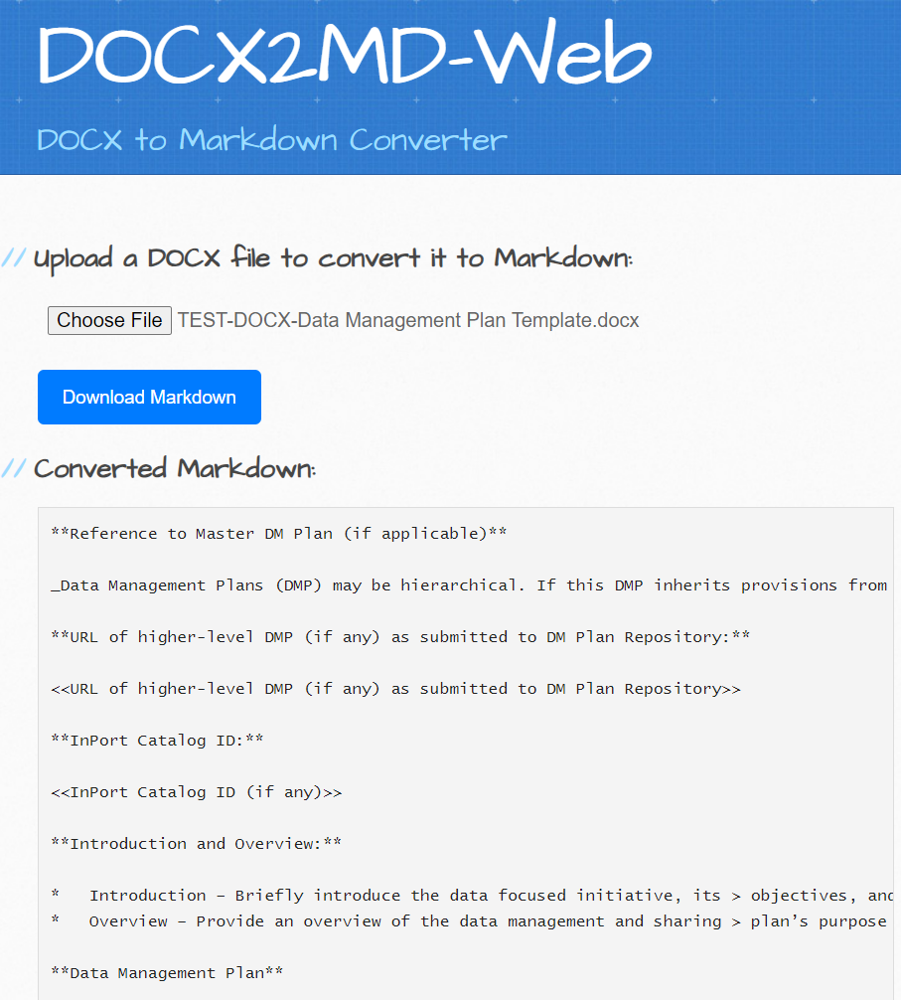

# DOCX to Markdown (DOCX2MD) Web Converter

GitHub Pages site that allows users to upload `.docx` file and convert them to Markdown (`.md`). The site uses JavaScript libraries Mammoth.js and Turndown.js to perform the conversion directly in the browser.
### - https://michaelakridge-noaa.github.io/docx-to-md-web/

## Features
- **Upload and Convert**: Users can upload `.docx` files, which are then converted to Markdown.
- **Download Markdown**: After conversion, users can download the Markdown file with a single click.

## How It Works
1. **Upload a DOCX File**: Click on the "Choose File" button to select a `.docx` file from your computer.
2. **Conversion**: The file is converted to Markdown using Mammoth.js (for DOCX to HTML) and Turndown.js (for HTML to Markdown).
3. **Download**: Once converted, a "Download Markdown" button will appear. Click it to download the converted file as `converted.md`.

## Usage

This site is hosted on GitHub Pages. Simply visit the site, upload your `.docx` file, and download the Markdown version.

## Credits / Libraries Used

- [Architect Jekyll Theme](https://github.com/pages-themes/architect): for GitHub Pages
- [Mammoth.js](https://github.com/mwilliamson/mammoth.js): Converts `.docx` files to HTML.
- [Turndown.js](https://github.com/domchristie/turndown): Converts HTML to Markdown.

----------
### Disclaimer
This repository is a scientific product and is not official communication of the National Oceanic and Atmospheric Administration, or the United States Department of Commerce. All NOAA GitHub project content is provided on an ‘as is’ basis and the user assumes responsibility for its use. Any claims against the Department of Commerce or Department of Commerce bureaus stemming from the use of this GitHub project will be governed by all applicable Federal law. Any reference to specific commercial products, processes, or services by service mark, trademark, manufacturer, or otherwise, does not constitute or imply their endorsement, recommendation or favoring by the Department of Commerce. The Department of Commerce seal and logo, or the seal and logo of a DOC bureau, shall not be used in any manner to imply endorsement of any commercial product or activity by DOC or the United States Government.

#### License
See the [LICENSE.md](./LICENSE.md) for details
